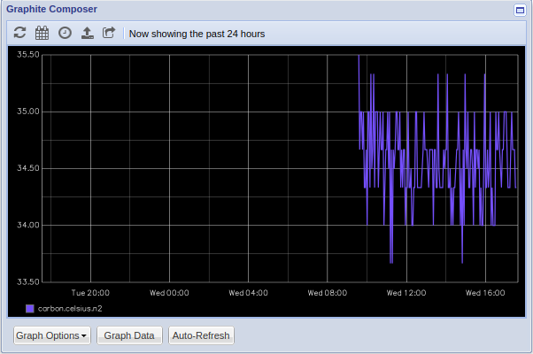

# pi4-temperature2graphite

This repository will create a small docker image based on Alpine ARM64 image with a small script `entrypoint.sh` which will send every minute the temperature of the node where the container runs on to the graphite carbon service (port 2003).

The docker image is pushed afterwards by the `build.sh` script to the Github Docker registry:

```bash
gdha@n1:~/projects/pi4-temperature2graphite$ ./build.sh 
Login Succeeded
Building pi4-temperature2graphite:v1.0
Sending build context to Docker daemon  75.26kB
Step 1/8 : FROM alpine:latest
 ---> a349cfd1d425
Step 2/8 : LABEL org.opencontainers.image.sourcec=https://github.com/gdha/pi4-temperature2graphite
 ---> Running in 1c27d35072a6
Removing intermediate container 1c27d35072a6
 ---> 02e9acffa794
Step 3/8 : LABEL org.opencontainers.image.description "pi4-temperature2graphite build for the ARM64"
 ---> Running in 89a3250df4ee
Removing intermediate container 89a3250df4ee
 ---> 264471e6c8c1
Step 4/8 : LABEL org.opencontainers.image.licenses "GPL-3.0-or-later"
 ---> Running in 657c836c6128
Removing intermediate container 657c836c6128
 ---> fad8d0088468
Step 5/8 : LABEL maintainer "Gratien Dhaese <gratien.dhaese@gmail.com>"
 ---> Running in 20d4bf907f2e
Removing intermediate container 20d4bf907f2e
 ---> dcad12f48f99
Step 6/8 : COPY entrypoint.sh                                  /entrypoint.sh
 ---> d360815e638e
Step 7/8 : RUN  chmod a+x                                      /entrypoint.sh      && echo "Europe/Brussels" >                    /etc/timezone
 ---> Running in d0913f0f6fdb
Removing intermediate container d0913f0f6fdb
 ---> 5ee6581588bf
Step 8/8 : ENTRYPOINT ["/entrypoint.sh"]
 ---> Running in 0b7610cb27ca
Removing intermediate container 0b7610cb27ca
 ---> 4cc35a19e247
Successfully built 4cc35a19e247
Successfully tagged ghcr.io/gdha/pi4-temperature2graphite:v1.0
Pushing pi4-temperature2graphite:v1.0 to GitHub Docker Container registry
The push refers to repository [ghcr.io/gdha/pi4-temperature2graphite]
1dc7bd164f08: Pushed 
6b1ef6f7b1d0: Mounted from gdha/temperature2graphite 
4e8e4928c701: Mounted from gdha/temperature2graphite 
v1.0: digest: sha256:b714b8d285f96e0823248b75f32f700d08cd3a85e684b280913816457950515c size: 942
```

To use an higher version number use the command `./build.sh v1.1`

The content of the script `entrypoint.sh` is basically the following:

```bash
HOSTNAME=$(cat /etc/hostname)
while true
do
  # keep the SERVER line inside the loop as at each restart the graphite pod gets a new IP address
  SERVER=$(/usr/bin/kubectl -n graphite get pods -o wide | tail -1 | awk '{print $6}')
  cpu_temp=$(cat /sys/class/thermal/thermal_zone0/temp)
  cpu_temp=$(expr $cpu_temp / 1000)
  echo "carbon.celsius.$HOSTNAME $cpu_temp $(date +%s)" | timeout 2 nc $SERVER 2003 
  sleep 60
done
```

The variable SERVER contains the IP address of the graphite pod and we use this as target to send the temperature data to graphite pod. Of course, we do assume that the graphite pod exists and can store its data in a PVC (on a k3s cluster).

If it works we should see an output like the following:



To integrate this container into the k3s cluster go into the `kubernetes` directory and check its readme file.
